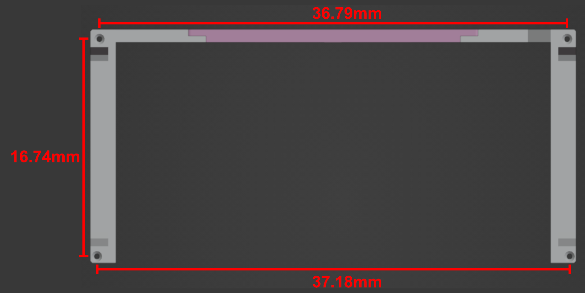

# HP ZBook G5 laptop stand/dock

> ✨ Find this model on `Printables.com` [here](https://www.printables.com/model/238854-hp-zbook-studio-g5-laptop-standdock)

3D printable files for a simple stand/dock for the `HP ZBook Studio G5` series (which includes the [normal G5](https://support.hp.com/nl-nl/product/hp-zbook-studio-g5-mobile-workstation/18865653/manuals) and the [G5 x360](https://support.hp.com/nl-nl/drivers/selfservice/hp-zbook-studio-x360-g5-convertible-workstation/20075826)). The stand is meant to be used with the laptop in docked position. That is, for use cases where you use the laptop closed with external monitor and keyboard etc.

The stand will serve as a convenient place to slot in the laptop, freeing up precious desk space. The laptop fan inlets are a few centimeters off the ground, while the fan exit vents remain unobstructed - cooling should be **as good as or better than** simply having it sit flat on a desk. 

The printable files have cut-outs for the USB ports and charger, to ensure more bulky cables will still fit. If you have any jumbo-sized cables you can modify the design to suit your needs.

> Unfortunately, the 3.5mm headphone jack will be blocked in the default position. Luckily for us, the HP ZBooks of this generation often have issues with the headphone jack anyway 🤣. If you really need this, you can elongate the main supports to get them cleared.

Some other features
* Carry handles to easily move design around. 
* Some unused M4 openings to easily add your own add-ons (e.g. cable holders) without needing to reprint the design or use `Blender`
* Printable on smaller 3D printers such as the Prusa Mini

### Printing

The design consists of three parts, which can be printed on a `Prusa Mini`, so pretty much any printer can print these designs. There are some small and large overhangs - these will need supports. 

> ⚠️ The designs need to be scaled by 10X to be the correct size in `PrusaSlicer`

Print time on a stock `Prusa Mini` is about 14 hours. On a `Mini` the parts have to be printed individually; on bigger printers they can probably be made to print in one go.

### Other parts

Besides the 3D printed parts, you will need a few extra components that can be sourced from your local hardware store.

* [4X] M4 60mm screws - these will secure the print to the top surface
* [4X] M4 bolts 5mm or longer with matching hex nuts — these connect the 3 printed parts together
* A plank cut to desired size. At least 38.2x18cm, but it can be made larger if desired (within reason). 
* [optional] [4X] anti-slip pads (0.7mm diameter)

### Assembly

1. Remove support material for printed parts
   
   1. It might be a bit tricky to remove supports from the screw holes; some tools and patience are required (depending on your support settings)
2. Secure the 3 printed parts together through the M4 bolts
3. Place the now connected parts down onto the plank
4. Secure the 2 screws at the back side of the prints 
   
   1. Depending on the wood type you may need predrill the holes, or use power tools. 
   
2. If you want to predrill the holes (not needed for soft materials — where  you can just use the printer parts as screw guides) you can use the following values:
   
     
   
5. Secure the 2 screws towards the front 
   1. ⚠️pay attention that the distance between these screws is correct (36.5mm between **innermost points** touching the wood panel), as the printed parts can be splayed apart/together
      1. The best way to ensure this (beyond measuring) is to simply place the laptop on the wooden surface as measurement tool. There should be about 0.2mm clearance on each side of the laptop.

### Remixing

The design is done in [Blender](https://www.blender.org/) (yeah I know, not ideal). The source `.blend` file can be opened in Blender `3.0+`. If you are familiar with Blender it should be easy to modify the design to your liking as most of the features are done with modifiers meaning remixing  is easy.